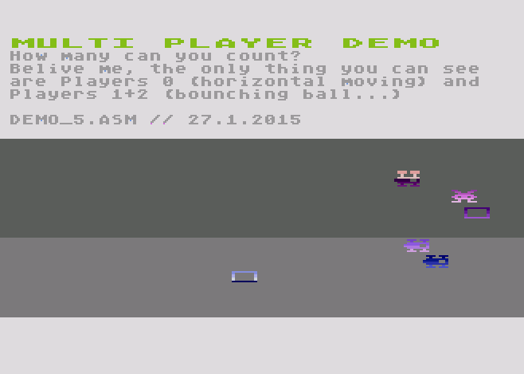

Atari 8-bit computer player/ missile gfx
----------------------------------------
Shows the use of the grafp0- register in order to draw player/ missile gfx one scanline at a time.
This is a collection of various tests. 

[Demo 5](Player_5.asm) is the most advanced. The demo uses only player0 to display five moving objects. Player1+2 are used
to display an object composed of two colors. 

So, six moving objects from only three player's are displayed. Racing the beam.....

Demo 5
