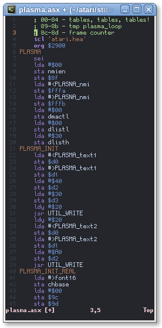

VIM Syntax Highlighting for MADS
================================

Installation
------------
* Manually: Put folders `syntax` and `ftdetect` in your Vim configs directory:
    * Windows: `%USERPROFILE%\vimfiles`
    * Rest of world: `~/.vim`
* **Recommended**: Using [Pathogen](https://github.com/tpope/vim-pathogen/)
    * `git clone https://github.com/skrzyp/vim-mads ~/.vim/bundle/vim-mads`

Screenshot
----------

Links
-----

* [MADS](http://mads.atari8.info)
* [atari.area thread](http://www.atari.org.pl/forum/viewtopic.php?id=13407)
